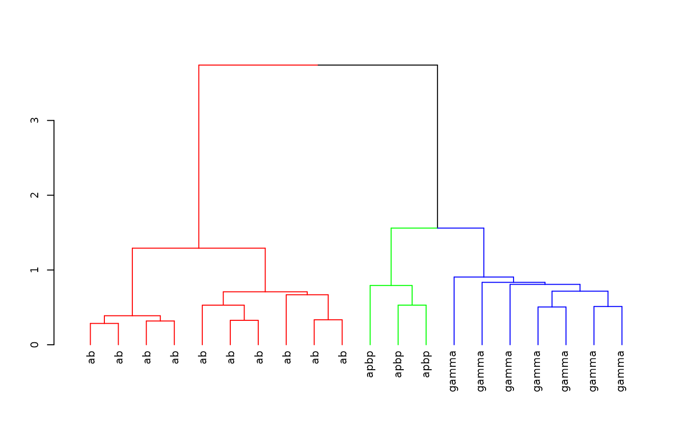

# NBLAST Clustering

## Startup

Install the package if required

``` r
install.packages('nat.nblast', dependencies = TRUE)
```

Load the package and set up for knitr / 3D snapshot figures

``` r
library(nat.nblast)
```

    ## Warning in rgl.init(initValue, onlyNULL): RGL: unable to open X11 display

    ## Warning: 'rgl.init' failed, will use the null device.
    ## See '?rgl.useNULL' for ways to avoid this warning.

``` r
rgl::setupKnitr()
```

## Clustering with NBLAST scores

### All by all scores

First we create a 20 x 20 NBLAST all by all score matrix for 20 Kenyon
cells included with the *nat* package

``` r
library(nat)
kcscores <- nblast_allbyall(kcs20)
```

### Clustering

Hierarchically cluster the Kenyon scores and divide the clustering into
3 groups

``` r
hckcs <- nhclust(scoremat=kcscores)
```

    ## The "ward" method has been renamed to "ward.D"; note new "ward.D2"

``` r
library(dendroextras)
dkcs <- colour_clusters(hckcs, k=3)
```

Plot a dendrogram of the clustering, with leaves labelled by true neuron
type

``` r
labels(dkcs) <- with(kcs20[labels(dkcs)], type)
par(cex=.7) # so labels are legible
plot(dkcs)
```



### 3D plot

You can create interactive 3D plots using the rgl package where
different subgroups of neurons are coloured according to the calculated
clustering.

``` r
plot3d(hckcs, k=3, db=kcs20, soma=T)
par3d(userMatrix=diag(c(1,-1,-1,1), 4))
plot3d(MBL.surf, alpha=.1)
```


